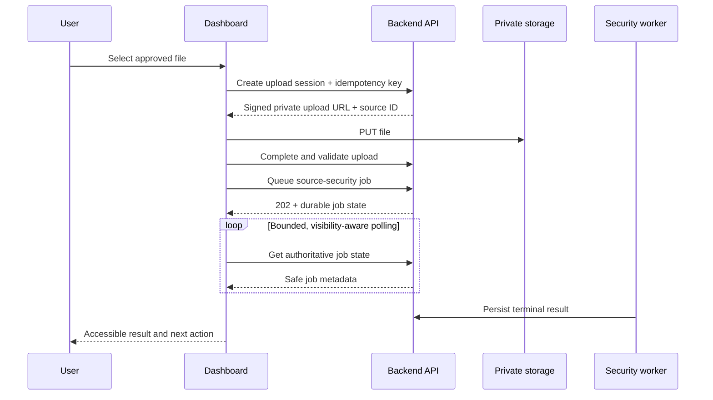

# Async Status and Recovery UX

## Boundary

Slice 1H adds a feature-flagged compatibility layer for approved durable operations. It does not perform AI extraction, drafting, guidance, proposal mutation, or publication.

Enable only in the authorized test environment:

```env
NEXT_PUBLIC_ASYNC_STATUS_ENABLED=true
```

## Vertical slice

On an existing proposal edit screen, the private-document panel:

1. Requests an authenticated, proposal-scoped private upload session.
2. Uploads the selected file directly to the signed private-storage URL.
3. Completes server-side content validation and checksum creation.
4. Creates an idempotent durable source-security job.
5. Stores only the job UUID in session storage.
6. Polls authoritative job state with bounded backoff, pausing while the tab is hidden.
7. Presents queued, running, retrying, delayed, success, failure, cancellation, and dead-letter states accessibly.



## Safety controls

- Response data is parsed against a strict frontend job contract.
- Raw backend errors are replaced by a fixed safe-message catalogue.
- Correlation IDs appear only when support action is useful.
- Browser persistence excludes file data, signed URLs, source IDs, content, tokens, and raw errors.
- The backend remains authoritative for identity, tenant, ownership, status, retryability, and completion.
- Duplicate submissions are constrained by an operation idempotency key and disabled controls.
- The legacy proposal creation flow remains unchanged when the feature flag is false.

## Accessibility

- Explicit file label and help relationship.
- Keyboard-operable action with visible focus styling.
- Polite live-region updates for progress and assertive announcement for terminal errors.
- Semantic progressbar with numeric value.
- Status meaning is expressed in text, not color alone.
- Reduced-motion users do not receive progress animations.

## Recovery

- Refresh recovery uses the session-stored job UUID and an immediate authoritative status fetch.
- Active polling begins at two seconds and backs off to ten seconds.
- Hidden tabs pause normal polling and resume safely.
- After sixty seconds, the user sees delayed guidance without the UI falsely completing the job.
- Terminal states remove the browser recovery reference.
