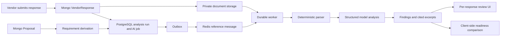

# Current System Analysis

## Executive finding

RFPilot already has a credible foundation for vendor intelligence: private vendor uploads, fail-closed malware scanning, proposal ownership checks, asynchronous jobs, an outbox, model governance, evidence citations, PostgreSQL RLS, and a basic comparison UI. The correct path is an evolutionary extension, not a greenfield replacement.

The current capability is nevertheless response-level analysis, not a complete procurement evaluation system. It analyzes each response independently, derives at most 80 requirements from populated proposal fields, and presents a confidence-weighted readiness score. It does not freeze input versions, normalize bids, support evaluator assignments, maintain scoring decisions, or create one proposal-wide comparison snapshot.

## Existing flow

## Capability inventory

| Area | Current implementation | Reuse | Gap to close |
|---|---|---|---|
| Proposal authority | Mongo proposal plus canonical proposal contract | Keep | Persist a frozen proposal/requirement-set reference per run. |
| Vendor submission | One Mongo `VendorResponse` per proposal and email | Replace behavior, retain compatibility adapter | Updates mutate identity/message and append documents; no immutable versions or BAFO lineage. |
| Private files | Private object paths, upload validation, malware scan | Keep and generalize | Register vendor files in the governed document-source lifecycle and unify storage configuration. |
| Parsing | PDF native text, DOCX, XLSX, CSV, TXT fragments with checksums/coordinates | Keep behind provider interface | Add scanned-PDF/image OCR and stronger table/layout fallback. |
| Requirements | Filled approved candidate paths plus room records, capped at 80 | Reuse only as one input adapter | It omits narrative, submission, mandatory, reference, DEI, legal, and commercial requirements. |
| AI analysis | Structured compliance/pricing/production/question findings with confidence, review flag, citations | Keep concepts and provider gateway | Split facts from assessments, expand schemas, validate arithmetic, and operate on immutable source versions. |
| Evidence | Cited excerpts, origin, locator, checksum per analysis run | Reuse and normalize | Evidence identity is run-local and duplicates extraction work; add reusable source-version fragments. |
| Jobs | PostgreSQL `ai_jobs`, attempts, dead letters, transactional outbox, Redis dispatcher, worker leases | Keep | Add persisted job dependencies and proposal-wide fan-out/fan-in aggregation. |
| Tenancy | Organization membership, ownership checks, RLS, scoped bearer sessions | Keep | Add procurement/evaluation assignment and price-visibility policy. |
| Comparison | Dashboard loads latest analysis for each response with `Promise.all` | Replace | Create one backend comparison resource with a frozen manifest, shared status, and persisted results. |
| Scoring | Addressed 100, partial 50, missing 0; weighted by AI confidence | Retire as award/readiness score | Confirmed RFP weights must drive scoring; confidence must drive review priority only. |
| Export | Single-response HTML review export | Reuse rendering boundary | Add proposal-wide comparison, executive report, evaluator record, and audit export. |
| Retention | Analysis runs expire after 30 days | Revisit | Procurement retention and legal hold require an explicit policy. |

## Current source-of-truth boundaries

The existing canonical architecture says:

- MongoDB owns proposal content and lifecycle.
- PostgreSQL owns AI jobs, runs, evidence, reviews, pricing, audit, and the outbox.
- Private S3-compatible storage owns uploaded bytes.
- Redis is transport only.

Proposal intelligence must preserve these boundaries. The design therefore keeps vendor submission identity and immutable version metadata beside proposal lifecycle data in MongoDB, while PostgreSQL owns the reconstructable intelligence graph keyed to those immutable Mongo identifiers and checksums.

## Material defects in the current response model

### Mutable submissions

`VendorResponse` has a unique `{proposalId, email}` index. A subsequent submission updates vendor name, submitter, and message, then appends files to the same record. Earlier content cannot be reconstructed reliably.

Required correction:

- Keep a stable `VendorSubmission` identity for proposal plus vendor.
- Create a new `VendorSubmissionVersion` for every initial, revised, clarification, or BAFO submission.
- Record parent version, reason, source-document manifest, received timestamp, and immutable checksum.
- Make the current version a pointer, not an overwrite.

### Incomplete requirement derivation

`buildRequirements` reads populated scalar candidate paths and rooms. This is useful for technical field coverage, but an RFP also contains requirements expressed in rendered narrative and policy sections. Examples include response instructions, references, staffing-plan expectations, pricing presentation, client mix, insurance, sustainability/DEI, evaluation criteria, and required forms.

Required correction: publish a versioned requirement set containing origin, source locator, type, mandatory flag, criterion, importance, verification method, and approved wording.

### Confidence-weighted readiness is not procurement scoring

The dashboard currently multiplies the addressed/partial/missing value by model confidence. This causes high-confidence extraction to behave like high business importance. Those are different concepts.

Required correction:

- Criterion importance comes only from the planner-confirmed evaluation matrix.
- Compliance status contributes to evidence coverage.
- Confidence controls review priority and whether a result may be suggested without escalation.
- Evaluator scores and final decision authority remain human actions.

### Independent latest-run comparison

The comparison UI fetches whichever analysis is latest for each response. Those analyses may have been produced from different proposal versions, requirement sets, submission versions, prompts, schemas, or models.

Required correction: a comparison run must select and freeze all vendor submission versions and every governing version before work begins.

### Evidence is cited but not reusable enough

The current analysis stores a short excerpt only when cited. That enables review, but the same document is reparsed for later runs and the fragment identity exists only within that run.

Required correction: source-document versions and evidence fragments should be immutable and reusable by checksum. Assessment runs cite those fragments through join records.

## Reuse versus replacement

### Reuse unchanged

- Organization and user identity resolution.
- Proposal ownership and canonical proposal contract.
- Private upload, scan, storage, and presigned-access controls.
- PostgreSQL RLS and transaction-scoped tenant settings.
- AI provider gateway, attempt ledger, kill switches, structured-output validation pattern, and usage capture.
- `ai_jobs`, job attempts, leases, dead letters, transactional outbox, dispatcher, and Redis reference-only transport.
- Dashboard server actions/BFF boundary and async status UX principles.
- Existing proposal evaluation matrix as the initial criterion-weight source.

### Extend

- `document_sources.purpose` to include vendor submission sources.
- The deterministic parser through an extraction-provider port with OCR fallback.
- Vendor analysis schemas into fact, mapping, assessment, commercial, and question schemas.
- Job orchestration with persisted dependencies and aggregate progress.
- Organization authorization actions plus proposal-scoped evaluator assignments.
- Export rendering to proposal-wide reports.

### Replace behind compatibility layers

- Mutable `VendorResponse` updates with submission/version records.
- Run-local fragment arrays with reusable source-version fragments.
- Latest-per-vendor comparison with a comparison-run resource.
- Confidence-weighted readiness as a scoring method.
- Single-page inbox/detail behavior with proposal-centric intelligence routes.

### Retire after migration

- Direct analysis of document URLs that bypass governed document-source registration.
- The 30-day hard-coded analysis retention rule.
- Any UI language that implies the AI score is an award recommendation.

## Baseline acceptance criteria for the initiative

- A prior comparison remains reproducible after a vendor revises its response.
- Every material fact and assessment resolves to an immutable evidence fragment and source version.
- The system can represent unknown, contradictory, unreadable, and not-applicable states without inventing an answer.
- All compared vendors in a snapshot use the same proposal, requirement set, evaluation matrix, scoring rules, and schema versions.
- Price comparisons expose normalization assumptions and refuse misleading arithmetic when bids are not comparable.
- AI cannot make or conceal an eligibility, shortlist, or award decision.
- Technical evaluators can be prevented from viewing pricing when the procurement owner enables sealed commercial review.
- A changed input marks prior results stale while preserving the old snapshot and audit trail.
