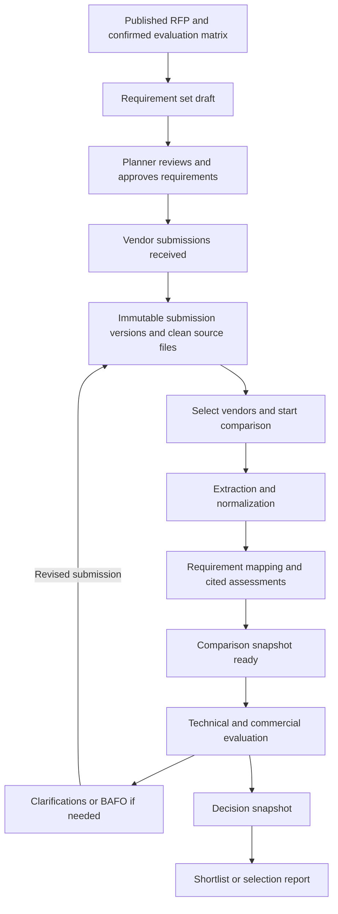

# Product and UX Flow

## Product objective

Help a planner move from received vendor documents to an evidence-backed shortlist or award decision without retyping proposals into a spreadsheet. The system organizes and checks what vendors provided; the evaluation team remains responsible for judgment and selection.

## Primary journey

## Stage 1: prepare the evaluation basis

Entry point: a published proposal with vendor-visible content.

The planner opens Proposal Intelligence and sees an evaluation-readiness check:

- proposal version and publish status;
- confirmed or unconfirmed evaluation matrix;
- requirement-set status;
- vendor response count and latest version state;
- files that are still scanning, blocked, unreadable, or unsupported;
- missing business decisions such as currency, price visibility, retention, and decision authority.

The system generates a requirement-set draft from:

1. canonical proposal fields;
2. room-by-room schedules and technical specifications;
3. rendered RFP narrative and tables;
4. submission instructions and mandatory forms;
5. confirmed evaluation criteria and weights;
6. explicit commercial, staffing, reference, DEI, insurance, and policy requirements.

The planner must review mandatory flags, criterion assignment, and ambiguous items before the requirement set becomes `approved`.

## Stage 2: receive and version submissions

The vendor experience remains document-first. Vendors can submit a cover note and multiple files. RFPilot creates an immutable version and returns a receipt identifying the version and submission time.

Version reasons:

- `initial`
- `vendor_revision`
- `clarification_response`
- `bafo`
- `administrative_correction`

A planner can choose which version participates in a comparison. The system never silently promotes a newer version into an already-running or completed comparison.

## Stage 3: create a comparison

The planner selects two or more vendors and reviews the frozen input manifest before starting:

- proposal version;
- approved requirement set;
- evaluation matrix version and total weight;
- exact submission version for each vendor;
- extraction and scoring policy versions;
- currency and commercial-normalization policy;
- price visibility mode;
- optional evaluator assignments.

Starting creates one comparison run and a job graph. Progress is shown by meaningful stages: Preparing sources, Extracting evidence, Mapping requirements, Normalizing commercial terms, Building comparison, and Awaiting review.

## Stage 4: review intelligence

The completed snapshot opens on Overview. Every view uses the same run ID.

### Overview

- vendor cards with submission version, evaluated price status, mandatory-item status, evidence coverage, unresolved risks, and human-review count;
- clear `Current`, `Stale`, `Incomplete`, or `Failed` state;
- no winner badge generated by AI;
- shortlist and selection controls visible only to decision authority.

### Requirements

A matrix of requirements by vendor with statuses:

- Addressed
- Partially addressed
- Missing
- Contradictory
- Not applicable
- Not assessable

Selecting a cell opens evidence, extracted facts, AI rationale, confidence, validation warnings, and reviewer decisions.

### Technical

Criterion-level summaries, staffing plan, equipment/production approach, hybrid/virtual capability, risk, exceptions, and references. Technical evaluators can score assigned criteria using the published rubric.

### Commercial

Submitted totals and normalized comparison totals remain visibly separate. The UI shows currency, time period, equipment, labor, travel/freight, tax, lodging, venue fees, options, exclusions, payment/cancellation terms, and every normalization assumption.

If offers are not comparable, the system says so and withholds a calculated price score.

### Risks and gaps

- mandatory omissions;
- conflicting statements;
- exclusions and exceptions;
- unusually low/high price components;
- missing staffing roles or coverage;
- unreadable or unsupported source content;
- unverified references;
- questions that should be sent to vendors.

Risk severity is rules-based where possible and always includes its basis.

### Evaluation

Evaluators see only assigned criteria and permitted commercial data. They record score, rationale, cited evidence, conflict-of-interest acknowledgment, and submit/finalize state. Submitted evaluations are append-only; corrections create a superseding event.

### Reports and audit

Users with permission can generate:

- executive comparison report;
- detailed requirement matrix;
- commercial normalization schedule;
- evaluator scorecard;
- clarification question pack;
- decision record and audit manifest.

## Clarification and BAFO loop

Questions originate from reviewed gaps, not directly from a model to a vendor. A planner selects, edits, approves, and records the questions sent. Responses create a new submission version linked to the question set.

The planner then creates a new comparison snapshot or explicitly refreshes into a new run. The earlier result remains available as historical evidence.

## Stale-result experience

A completed run becomes stale when any governing input changes. The banner must name the changed inputs, for example:

> This comparison used Northstar AV submission v1. A v2 response was received on August 12. Create a new comparison to include it.

Stale results remain readable and exportable with a prominent historical label. They cannot be used to create a new final decision snapshot without acknowledgment and decision-authority permission.

## Failure and recovery states

| State | User experience | Recovery |
|---|---|---|
| File scanning | Source listed but analysis cannot start | Wait; status updates asynchronously. |
| Blocked/infected | File excluded with safe code, no content preview | Vendor/planner replaces file. |
| Image-only document | OCR fallback status and page coverage shown | Retry provider or mark not assessable. |
| Partial extraction | Completed with warnings and uncovered pages/sections | Review evidence, upload accessible source, or continue with acknowledgment. |
| Model/schema failure | No speculative result is shown | Automatic bounded retry, then operator-safe error. |
| Commercial mismatch | No normalized score | Resolve assumptions or evaluate price manually. |
| Stale inputs | Historical snapshot banner | Start a new comparison from current versions. |
| Job failure | Completed stages remain persisted | Retry failed branch idempotently or cancel run. |

## Accessibility and trust requirements

- Status never relies on color alone.
- Tables have row/column headers, keyboard navigation, and a non-grid list alternative on small screens.
- Evidence drawers preserve source page/sheet/section locators and support keyboard focus return.
- AI-generated text is labeled; deterministic values and human decisions use distinct labels.
- Confidence is shown as review reliability, not a quality grade.
- Empty, unavailable, not applicable, and zero are visually and semantically distinct.
- Exported reports include the input manifest, generation timestamp, staleness status, and human-decision disclaimer.
