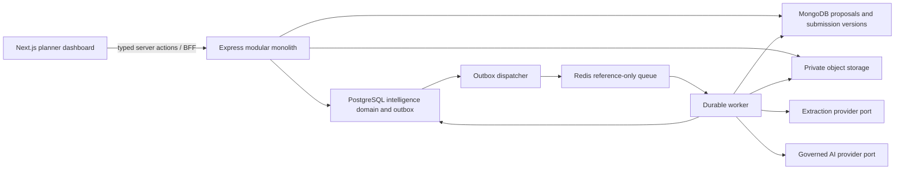
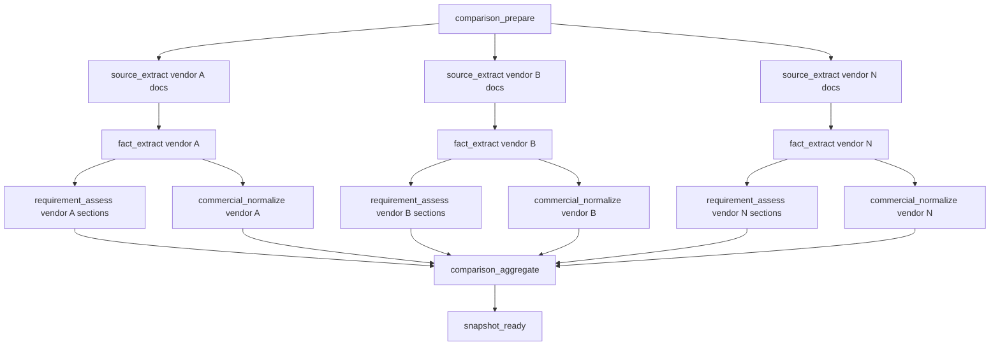

# Technical Architecture

## Target topology



No new deployable service is required for the initial implementation. Proposal intelligence becomes new bounded modules inside the existing backend and dashboard repositories.

## Backend module boundaries

| Module | Responsibility | Must not do |
|---|---|---|
| `vendorSubmissions` | Stable submission identity, immutable versions, source manifest, clarification/BAFO lineage | Analyze documents or score vendors. |
| `requirementRegistry` | Generate, review, approve, version, and read RFP requirements and evaluation criteria | Mutate the published proposal. |
| `evidenceExtraction` | Register clean sources, parse/OCR, persist immutable fragments and tables, record coverage | Interpret compliance or award suitability. |
| `proposalIntelligence` | Create comparison manifests, orchestrate dependencies, aggregate status, expose snapshot views | Read raw provider output without validation. |
| `vendorFacts` | Persist schema-validated facts with citations and contradiction state | Calculate evaluator scores. |
| `vendorAssessment` | Map requirements to evidence, generate cited assessments, risks, gaps, and questions | Make final eligibility/award decisions. |
| `commercialEvaluation` | Normalize bid components deterministically and record assumptions/refusals | Infer unsupported prices. |
| `evaluations` | Assign evaluators, record append-only scores/rationale, lock/finalize decision snapshots | Let AI submit an evaluator response. |
| `intelligenceReports` | Render authorized, immutable snapshot exports | Re-run analysis during export. |

## Store ownership

| Data | Authority | Notes |
|---|---|---|
| Proposal content/lifecycle/version | MongoDB | Existing proposal model remains authoritative. |
| Submission identity/version metadata | MongoDB | Close to vendor/public lifecycle; versions are immutable after receipt. |
| Uploaded bytes | Private object storage | Object version/checksum referenced by source documents. |
| Requirement sets and criteria | PostgreSQL | Versioned derived procurement domain tied to proposal version/checksum. |
| Source registrations, fragments, tables, extraction coverage | PostgreSQL | Immutable/reconstructable AI evidence domain. |
| Facts, mappings, assessments, risks, commercial normalization | PostgreSQL | Derived records with schema/version/provenance. |
| Evaluator assignments, score events, decisions, audit | PostgreSQL | RLS plus proposal-scoped authorization. |
| Work state/dependencies/outbox | PostgreSQL | Authoritative orchestration state. |
| Queue messages/rate limits | Redis | IDs and references only. |

## Durable orchestration

One comparison request creates a root run and an immutable input manifest in a single transaction. It then creates a job graph:



### Dependency rules

- PostgreSQL stores each parent/child dependency and completion condition.
- An outbox event is emitted only when a job becomes runnable.
- Redis loss cannot lose the graph; the dispatcher can republish pending events.
- Each logical job has an idempotency key derived from tenant, comparison run, job type, vendor version, section, schema version, and input checksum.
- A succeeded child is reused on retry when its input checksum and implementation versions match.
- The root run may complete `succeeded_with_warnings` when an optional branch fails; mandatory-source, manifest, tenancy, or validation failures fail closed.
- Cancellation cascades to pending children and requests cancellation for running children; completed evidence remains auditable.
- Progress is calculated from persisted weighted stages, never guessed from elapsed time.

## Input manifest

Every comparison freezes:

- organization and proposal reference;
- proposal Mongo ID, version, canonical checksum, and published timestamp;
- requirement-set ID/version/checksum;
- evaluation-matrix ID/version/checksum and criteria weights;
- selected vendor submission IDs, version IDs, source-document IDs, and checksums;
- currency policy and normalization assumptions;
- price visibility policy;
- extraction engine/parser/OCR versions;
- fact, assessment, prompt, structured-output schema, validation, and scoring versions;
- provider/model release selection;
- initiator, correlation ID, and creation time.

The manifest is append-only. A refresh creates a new run.

## Extraction provider architecture

`EvidenceExtractionProvider` exposes a provider-neutral contract:

```text
extract(sourceVersion) -> {
  method: native_text | ocr | hybrid,
  engineVersion,
  pages,
  fragments,
  tables,
  warnings,
  coverage
}
```

Selection policy:

1. Use deterministic native parsing for supported text-bearing PDF/DOCX/XLSX/CSV/TXT.
2. Detect image-only/low-text pages and route only those pages to OCR.
3. Use a configured managed document-analysis adapter for tables/forms/layout when local parsing is insufficient.
4. Preserve page/sheet/slide, coordinates, row/column headers, reading order, and content checksum.
5. Never allow an OCR provider result to bypass malware, tenancy, size, MIME, retention, or source-version checks.

Initial adapter selection is an implementation-time deployment decision. The interface supports Textract or another approved provider without changing domain records.

## Authorization model

Organization actions are expanded with coarse capabilities, while proposal-scoped assignments limit actual evaluation access.

| Action | Planner owner | Procurement owner | Technical evaluator | Commercial evaluator | Observer | Decision authority | Org admin |
|---|---:|---:|---:|---:|---:|---:|---:|
| Read assigned comparison | ✓ | ✓ | ✓ | ✓ | ✓ | ✓ | ✓ |
| Manage requirements | owner only | ✓ |  |  |  | ✓ | ✓ |
| Start/cancel comparison | owner only | ✓ |  |  |  | ✓ | ✓ |
| View technical evidence | ✓ | ✓ | assigned | assigned | assigned | ✓ | ✓ |
| View commercial evidence | policy | ✓ | policy | ✓ | policy | ✓ | ✓ |
| Submit assigned score |  | optional | ✓ | ✓ |  | optional |  |
| Reopen evaluator submission |  | ✓ |  |  |  | ✓ | ✓ |
| Approve questions/BAFO | owner | ✓ |  |  |  | ✓ | ✓ |
| Finalize shortlist/award record |  |  |  |  |  | ✓ | delegated admin |
| Export report | policy | ✓ | assigned | assigned | view only | ✓ | ✓ |

Existing membership roles remain the first gate. `EvaluationAssignment` is a second, resource-scoped gate. The backend enforces both; frontend hiding is not security.

## Staleness

A comparison is current only when all manifest references still match the selected current inputs. Staleness reasons are enumerated:

- `proposal_version_changed`
- `requirement_set_superseded`
- `evaluation_matrix_superseded`
- `submission_version_available`
- `source_replaced`
- `extraction_policy_changed`
- `assessment_schema_changed`
- `scoring_policy_changed`
- `commercial_policy_changed`

Provider/model changes alone do not retroactively make a run stale; they are recorded for reproducibility. A release policy may recommend rerun without invalidating historical truth.

## Retention and audit

The hard-coded 30-day run retention must not be carried forward. Before Task 2, product/legal must choose a default procurement retention period and deletion rules. Architecture support is mandatory for:

- organization policy with proposal override;
- legal hold;
- cascading derived-data deletion only after source/lifecycle authorization;
- immutable audit events describing creation, review, export, staleness, decision, and deletion;
- exports that contain no live presigned URLs.

## Observability

Metrics and structured events must include run/stage counts, queue age, duration, retries, OCR rate, page coverage, schema rejection, citation validation rejection, unsupported commercial calculations, stale runs, human-review volume, evaluator completion, provider tokens/cost, and safe error codes. Logs never contain raw proposal or vendor document text.
