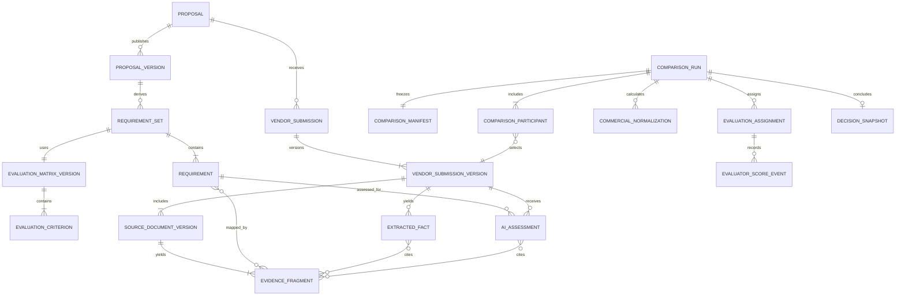

# Data Model and ERD

## Logical model

## MongoDB lifecycle records

### `VendorSubmission`

Stable identity for one vendor responding to one proposal.

| Field | Rule |
|---|---|
| `_id`, `organizationId`, `proposalId`, `proposalOwnerId` | Required and indexed. |
| `vendorIdentity` | Normalized organization name plus contact identity; do not rely on email alone. |
| `currentVersionId` | Pointer updated atomically after an immutable version is created. |
| `status` | `active`, `withdrawn`, `disqualified`, `archived`; AI cannot set disqualified. |
| `trackingIds` | Campaign/public grant lineage without making IDs authorization. |
| timestamps | Stable submission lifecycle timestamps. |

Unique active identity: organization, proposal, normalized vendor identity. The legacy proposal/email lookup remains as a compatibility index during migration.

### `VendorSubmissionVersion`

| Field | Rule |
|---|---|
| `_id`, `submissionId`, `versionNumber` | Unique and monotonically increasing. |
| `parentVersionId` | Null for initial; otherwise exact predecessor. |
| `reason` | Controlled vocabulary for initial/revision/clarification/BAFO/admin correction. |
| `submittedBy`, `email`, `message` | Snapshotted values, immutable. |
| `documents[]` | Source ID, object key/version, filename, MIME, size, SHA-256, scan state. No public URL. |
| `manifestChecksum` | Deterministic checksum of metadata and ordered document checksums. |
| `receivedAt`, `supersededAt` | Audit lifecycle; superseding does not mutate content. |
| `sourceSystem` | Public portal, planner upload, migration, or API. |

Immutability is enforced by application service and database middleware/tests. Only lifecycle annotations such as `supersededAt` may change.

## PostgreSQL intelligence records

### Requirement registry

- `requirement_sets`: proposal reference/version/checksum, status (`draft`, `in_review`, `approved`, `superseded`), generator/version, approval actor/time, checksum.
- `requirements`: stable key within set, type, title, normalized text, mandatory/eligibility flag, source kind/locator, criterion ID, importance, verification method, parent/group, ordinal.
- `evaluation_matrix_versions`: source proposal version, confirmed flag, total weight, checksum, supersession.
- `evaluation_criteria`: criterion key/name/description/weight, rubric levels, price visibility, human-only flag.

Approved requirement sets are immutable. Corrections create a new version.

### Sources and evidence

Extend existing governed document records rather than creating a second upload system:

- `document_sources`: add `vendor_submission` purpose and submission-version reference.
- `document_objects`: preserve object key, storage version, checksum, MIME, size.
- `source_extraction_runs`: source version, method, provider/engine version, parser/schema version, coverage, warnings, status.
- `evidence_fragments`: immutable source-version fragment, page/sheet/section locator, coordinates, content, checksum, ordinal, fragment kind.
- `evidence_tables` and `evidence_table_cells`: normalized table structure and headers when available.

Large raw content remains in private storage where appropriate; PostgreSQL content is bounded for review/search and retention-controlled.

### Facts and assessments

- `extracted_facts`: fact type, typed value JSON, normalized value, unit/currency/period, confidence, validation state, contradiction group, extraction version.
- `extracted_fact_evidence`: many-to-many citations with support role (`supports`, `contradicts`, `context`).
- `requirement_evidence_mappings`: requirement, submission version, evidence fragment, mapping confidence, mapping method/version.
- `ai_assessments`: requirement, submission version, verdict, rationale, confidence, human-review reasons, prompt/schema/model versions, run ID.
- `assessment_evidence`: many-to-many citations.
- `assessment_validation_results`: citation, enum, contradiction, business-rule, and coverage checks.

AI assessments are never overwritten. A superseding assessment references the earlier one.

### Comparison and commercial records

- `comparison_runs`: proposal, manifest, status, initiator, correlation, progress, stale state, warnings, completion.
- `comparison_manifests`: immutable JSON plus normalized foreign keys/checksum.
- `comparison_participants`: vendor/submission version and inclusion state.
- `commercial_submissions`: submitted total, currency, covered periods/years, explicit basis.
- `commercial_line_items`: category, description, quantity, unit, rate, extended amount, recurrence, option/exclusion, citations.
- `commercial_normalizations`: policy version, comparable total/range, assumptions, refusals, arithmetic status.
- `commercial_adjustments`: deterministic adjustment, formula, source fact/citation, human approval if subjective.

Never replace the submitted total with a normalized total. Both are first-class values.

### Human evaluation and decision

- `evaluation_assignments`: comparison, user, role, assigned criteria, commercial visibility, conflict declaration state.
- `evaluator_score_events`: append-only draft/submitted/reopened/superseded event; criterion, score, rationale, citations, rubric version.
- `human_review_events`: target fact/assessment/risk, decision, reason code, note, actor, timestamp.
- `clarification_sets`, `clarification_questions`, `clarification_dispatch_events`: reviewed question workflow.
- `decision_snapshots`: shortlist/selection/no-award outcome, included vendor IDs, rationale, evaluator state checksum, manifest checksum, authority actor/time.

## Version and checksum rules

| Object | Version trigger | Historical handling |
|---|---|---|
| Proposal | Existing proposal version/published update | Frozen reference plus canonical checksum. |
| Requirement set | Any requirement text/type/mandatory/source/criterion change | New set; old approved set remains readable. |
| Evaluation matrix | Criterion, weight, rubric, or visibility change | New version; weight total validated. |
| Submission | Any new vendor content or file | New immutable version. |
| Source extraction | Source checksum or extraction implementation/provider change | New extraction run; fragments keyed to run/source version. |
| Assessment | Inputs, prompt, schema, model policy, or validation version change | New assessment run. |
| Comparison | Any manifest input change | New comparison run. |
| Evaluator score | Submission, correction, or reopening | Append event; never update submitted event. |
| Decision | Any final outcome change | New superseding decision snapshot. |

## Migration mapping

| Legacy | Target |
|---|---|
| One `VendorResponse` | One `VendorSubmission` plus v1 `VendorSubmissionVersion`. |
| Response message/documents | Snapshotted v1 content and source-document registrations. |
| Vendor analysis run | Historical imported comparison-compatible assessment record, labeled legacy. |
| Vendor findings/evidence | Legacy assessments and bounded evidence citations; no invented requirement registry mapping. |
| Current client readiness score | Display only on historical legacy views, never migrated as an evaluator or award score. |

Migration is idempotent, journaled, dry-run capable, checksum verified, and reversible by switching reads back to the legacy adapter before new-version writes are enabled.
