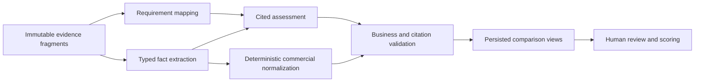

# AI and Evaluation Architecture

## Principle

The model performs bounded semantic extraction and assessment. Deterministic code owns eligibility rules, arithmetic, units/currency, weighting, validation, freshness, authorization, and workflow state. Humans own evaluation submissions and decisions.

## Pipeline



## Structured schemas

### Requirement mapping v1

Each item: requirement ID, candidate fragment IDs, relationship (`supports`, `partially_supports`, `contradicts`, `context_only`, `none`), confidence, and ambiguity reasons. Fragment IDs must come from the supplied allowlist.

### Vendor fact v1

Supported fact families:

- company profile and relevant experience;
- references and client mix;
- staffing roles, named staff, coverage, ratios, shifts, overtime;
- equipment/system approach and quantities;
- schedule, setup, rehearsal, strike, and logistics;
- hybrid/streaming/recording capabilities;
- accessibility, sustainability/DEI, insurance, and policy statements;
- commercial totals, components, options, exclusions, terms, and validity;
- assumptions, exceptions, dependencies, and alternatives.

Every fact includes typed value, units/currency/period, explicit/derived classification, confidence, citations, and contradiction group. Unknown values are omitted or marked unknown, never completed from general knowledge.

### Requirement assessment v1

Verdict vocabulary: `addressed`, `partial`, `missing`, `contradictory`, `not_applicable`, `not_assessable`. Each assessment includes rationale, cited fact/fragment IDs, confidence, human-review reason codes, and proposed clarification question if necessary.

### Risk/gap v1

Risk type, severity, impact, likelihood basis, requirement/criterion IDs, citations, deterministic rule IDs if any, review required, and mitigation/question. The model cannot label a vendor disqualified.

### Commercial extraction v1

Submitted totals, currencies, periods, line items, quantities, rates, extensions, tax, travel/freight, lodging, venue fees, options, exclusions, payment/cancellation, validity, and arithmetic observations. Normalized totals are not model fields.

## Validation boundary

Provider output is accepted only after:

1. strict structured-output validation;
2. size/count/string bounds;
3. ID allowlist validation;
4. citation existence and source-version validation;
5. requirement/submission/run ownership validation;
6. typed value, unit, currency, and date validation;
7. arithmetic reconciliation with tolerance and explicit unknowns;
8. contradiction checks across extracted facts;
9. prohibited-decision language detection;
10. minimum evidence/coverage rules.

Invalid items are rejected individually when safe. A systemic schema, tenancy, manifest, or citation failure fails the branch. Fallbacks may create an explicit `not_assessable`; they must not create generic positive findings.

## Scoring algorithm

### Evidence coverage

For reporting only, not award selection:

```text
coverage = requirements with assessable cited status / applicable requirements
```

Mandatory coverage is reported separately.

### Evaluator criterion score

An evaluator chooses a rubric score. The normalized weighted score is deterministic:

```text
criterion contribution = (submitted score / rubric maximum) * confirmed criterion weight
overall evaluator score = sum(contributions for applicable assigned criteria)
```

Rules:

- Criterion weights come only from the frozen confirmed matrix.
- AI confidence does not change a contribution.
- Missing required evaluator scores do not become zero silently; aggregation remains incomplete.
- Eligibility/mandatory failure is shown separately from numeric score unless the approved rubric explicitly defines a deterministic consequence.
- Price score formulas, if enabled, require a product-approved deterministic policy and comparable commercial inputs. Otherwise price is human-scored.
- Aggregating multiple evaluators uses a configured method (mean, median, consensus, or authority-approved final) captured in the matrix version.

### Recommendation policy

The system may summarize trade-offs and identify the highest completed human score. It may not generate a winner, shortlist, or selection as an AI conclusion. A decision snapshot must name the human authority and rationale.

## Confidence policy

Confidence answers “How reliable is this extraction/assessment?” It is used for:

- review queues;
- low-confidence warning badges;
- auto-accept prohibition thresholds;
- monitoring and evaluation.

It is not used for procurement weight, vendor quality, price value, shortlist probability, or award ranking.

## Prompt and evidence policy

- Source content is untrusted data and never instructions.
- Prompts receive only the current manifest’s requirements/fragments and bounded context.
- Vendor identities may be pseudonymized for model calls where the task does not need them.
- Sections are processed independently with source-fair evidence selection; aggregation uses persisted structured records rather than resending whole documents.
- Model input excludes other vendors when extracting one vendor’s facts to prevent cross-contamination.
- Cross-vendor synthesis receives validated facts/assessments, not raw documents.
- All calls use pre-call provider-attempt ledger rows, stable logical-phase keys, pinned releases, timeouts, token limits, and kill switches.

## Evaluation and release gates

Offline gold sets must cover native PDFs, scans, tables, DOCX, XLSX pricing, contradictory text, missing values, multi-year prices, options/exclusions, prompt injection, and multiple vendors. Release metrics include schema validity, citation precision, fact precision/recall, requirement-status agreement, commercial arithmetic accuracy, contradiction recall, unsupported-claim rate, latency, and cost.

Deployment requires:

- zero tenant/citation boundary violations;
- zero fabricated material prices in the gold set;
- approved thresholds for fact and compliance quality;
- reviewer acceptance against the supplied real RFP and vendor proposals;
- canary comparison against the prior model/prompt;
- rollback by version registry and feature flag.

## Model portability

Domain services depend on provider ports, not OpenAI types. Structured schemas, validation, evidence packaging, and attempt ledgers remain provider-independent. Changing to another approved provider requires benchmark evidence and an explicit release decision, not business-layer changes.
